# AIND Ephys Pipeline
## aind-ephys-pipeline

Electrophysiology analysis pipeline with [SpikeInterface](https://github.com/SpikeInterface/spikeinterface).

# Overview

The pipeline is based on [Nextflow](https://www.nextflow.io/) and it includes the following steps:

## Pipeline Architecture

```mermaid
flowchart TD
    %% Deployment paths
    subgraph code_ocean["🌊 Code Ocean Deployment"]
        direction TB
        co_main["<b><a href='pipeline/main.nf'>pipeline/main.nf</a></b><br/>(Nextflow DSL1)<br/>Code Ocean Platform"]
        co_branches["Branch Selection:<br/>• co_kilosort4 (main)<br/>• co_kilosort25<br/>• co_spykingcircus2<br/>• co_*_opto variants"]
        co_main -.->|"Branch determines<br/>sorter"| co_branches
    end

    subgraph slurm_local["🖥️ SLURM/Local Deployment"]
        direction TB
        mb_main["<b><a href='pipeline/main_multi_backend.nf'>pipeline/main_multi_backend.nf</a></b><br/>(Nextflow DSL2)<br/>Multi-backend Support"]

        subgraph executor["⚙️ Executor"]
            direction LR
            slurm_exec["<b><a href='https://aind-ephys-pipeline.readthedocs.io/en/latest/deployments.html#slurm-deployment'>SLURM</a></b><br/>Cluster execution"]
            local_exec["<b><a href='https://aind-ephys-pipeline.readthedocs.io/en/latest/deployments.html#local-deployment'>Local</a></b><br/>Single machine"]
        end

        mb_main -->|"Submitted to"| executor
    end

    co_main -->|"Copied from ➜"| mb_main

    %% Input/Output data
    input[("📥 Input Data<br/>(Ephys Session)")]
    output[("📤 Output<br/>NWB files + QC + Viz")]

    %% Hugging Face models
    subgraph hf_models["🤗 <a href='https://huggingface.co/SpikeInterface'>Hugging Face Models</a> (UnitRefine)"]
        direction TB
        noise_model["<b><a href='https://huggingface.co/SpikeInterface/UnitRefine_noise_neural_classifier'>noise_neural_classifier</a></b><br/>Noise vs. neural units"]
        sua_mua_model["<b><a href='https://huggingface.co/SpikeInterface/UnitRefine_sua_mua_classifier'>sua_mua_classifier</a></b><br/>Single-unit vs. multi-unit"]
    end

    %% Container registry
    subgraph registry["☁️ <a href='https://github.com/orgs/AllenNeuralDynamics/packages'>GitHub Container Registry</a> (ghcr.io)"]
        direction TB
        base["<b>aind-ephys-pipeline-base</b><br/>General processing<br/>(tag: si-0.103.0)"]
        ks25["<b>aind-ephys-spikesort-kilosort25</b><br/>Kilosort 2.5 sorter<br/>(tag: si-0.103.0)"]
        ks4["<b>aind-ephys-spikesort-kilosort4</b><br/>Kilosort 4 sorter<br/>(tag: si-0.103.0)"]
        nwb["<b>aind-ephys-pipeline-nwb</b><br/>NWB export<br/>(tag: si-0.103.0)"]
    end

    %% Common pipeline steps
    subgraph pipeline["📊 Processing Pipeline<br/>(<a href='https://github.com/SpikeInterface/spikeinterface'>SpikeInterface</a>-based)"]
        direction TB

        step1["<b>1. Job Dispatch</b><br/><a href='https://github.com/AllenNeuralDynamics/aind-ephys-job-dispatch'>aind-ephys-job-dispatch</a><br/>Generate parallel job JSONs<br/>(per probe/shank)"]

        step2["<b>2. Preprocessing</b><br/><a href='https://github.com/AllenNeuralDynamics/aind-ephys-preprocessing'>aind-ephys-preprocessing</a><br/>Phase shift • Highpass filter<br/>Denoising • Motion estimation"]

        step3a["<b>3a. Kilosort2.5</b><br/><a href='https://github.com/AllenNeuralDynamics/aind-ephys-spikesort-kilosort25'>aind-ephys-spikesort-kilosort25</a>"]
        step3b["<b>3b. Kilosort4</b><br/><a href='https://github.com/AllenNeuralDynamics/aind-ephys-spikesort-kilosort4'>aind-ephys-spikesort-kilosort4</a><br/>(GPU required)"]
        step3c["<b>3c. SpykingCircus2</b><br/><a href='https://github.com/AllenNeuralDynamics/aind-ephys-spikesort-spykingcircus2'>aind-ephys-spikesort-spykingcircus2</a>"]

        step4["<b>4. Postprocessing</b><br/><a href='https://github.com/AllenNeuralDynamics/aind-ephys-postprocessing'>aind-ephys-postprocessing</a><br/>Amplitudes • Locations • PCA<br/>Correlograms • Quality metrics"]

        step5["<b>5. Curation</b><br/><a href='https://github.com/AllenNeuralDynamics/aind-ephys-curation'>aind-ephys-curation</a><br/>QC thresholds<br/>UnitRefine classifier"]

        step6["<b>6. Visualization</b><br/><a href='https://github.com/AllenNeuralDynamics/aind-ephys-visualization'>aind-ephys-visualization</a><br/>Timeseries • Drift maps<br/>Figurl sorting summary"]

        step7["<b>7. Results Collector</b><br/><a href='https://github.com/AllenNeuralDynamics/aind-ephys-result-collector'>aind-ephys-result-collector</a><br/>Aggregate parallel outputs"]

        step8["<b>8. Quality Control</b><br/><a href='https://github.com/AllenNeuralDynamics/aind-ephys-processing-qc'>aind-ephys-processing-qc</a><br/>Run QC checks"]

        step9["<b>9. QC Collector</b><br/><a href='https://github.com/AllenNeuralDynamics/aind-ephys-qc-collector'>aind-ephys-qc-collector</a><br/>Aggregate QC results"]

        step10["<b>10. NWB Ecephys</b><br/><a href='https://github.com/AllenNeuralDynamics/aind-ecephys-nwb'>aind-ecephys-nwb</a><br/>Export raw/LFP data"]

        step11["<b>11. NWB Units</b><br/><a href='https://github.com/AllenNeuralDynamics/aind-units-nwb'>aind-units-nwb</a><br/>Export spike sorting results"]

        step1 --> step2
        step2 --> step3a & step3b & step3c
        step3a & step3b & step3c --> step4
        step4 --> step5
        step5 --> step6
        step2 & step3a & step3b & step3c & step4 & step5 & step6 --> step7
        step1 & step7 --> step8
        step8 --> step9
        step1 --> step10
        step10 & step7 --> step11
    end

    %% Data flow
    input -->|"Mounted as<br/>capsule/data/ecephys_session"| step1
    step7 & step9 & step11 -->|"Published to<br/>RESULTS_PATH"| output

    %% HF model usage
    noise_model -.->|"used by"| step5
    sua_mua_model -.->|"used by"| step5

    %% Container usage
    base -.->|"used by"| step1
    base -.->|"used by"| step2
    base -.->|"used by"| step4
    base -.->|"used by"| step5
    base -.->|"used by"| step6
    base -.->|"used by"| step7
    base -.->|"used by"| step8
    base -.->|"used by"| step9
    base -.->|"used by"| step3c
    ks25 -.->|"used by"| step3a
    ks4 -.->|"used by"| step3b
    nwb -.->|"used by"| step10
    nwb -.->|"used by"| step11

    co_main -.->|"Executes"| pipeline
    executor -.->|"Executes"| pipeline

    %% Version control
    versions["📋 <a href='pipeline/capsule_versions.env'>capsule_versions.env</a><br/>Pins Git commit hashes<br/>for each step"]
    pipeline -.->|"Version controlled<br/>via"| versions

    %% Styling
    classDef deployment fill:#e1f5ff,stroke:#0066cc,stroke-width:2px
    classDef pipeline_step fill:#fff4e6,stroke:#ff9800,stroke-width:2px
    classDef sorter fill:#f3e5f5,stroke:#9c27b0,stroke-width:2px
    classDef data fill:#e8f5e9,stroke:#4caf50,stroke-width:3px
    classDef container fill:#fce4ec,stroke:#e91e63,stroke-width:2px
    classDef ml_model fill:#fff9e6,stroke:#ffc107,stroke-width:2px

    class co_main,mb_main,co_branches,slurm_exec,local_exec deployment
    class step1,step2,step4,step5,step6,step7,step8,step9,step10,step11 pipeline_step
    class step3a,step3b,step3c sorter
    class input,output data
    class base,ks25,ks4,nwb container
    class noise_model,sua_mua_model ml_model
```

**Key Points:**
- **Two Deployment Modes**:
  - **Code Ocean** ([`pipeline/main.nf`](pipeline/main.nf)): Branch-based deployment with separate branches for different sorters:
    - `main`/`co_kilosort4`: Kilosort4
    - `co_kilosort25`: Kilosort2.5
    - `co_spykingcircus2`: SpykingCircus2
    - Plus `*_opto` variants with optogenetics artifact removal
  - **SLURM/Local** ([`pipeline/main_multi_backend.nf`](pipeline/main_multi_backend.nf)): Parameter-driven sorter selection, supports both SLURM clusters and local execution
- **Identical Pipeline**: Both deployment modes execute the same 11 processing steps
- **Data Binding**: Input data is mounted into each container at `capsule/data/ecephys_session`; outputs published to `RESULTS_PATH`
- **Parallelization**: Steps 2-6 run in parallel per probe/shank (configured by step 1)
- **Version Control**: Git commit hashes in [`capsule_versions.env`](pipeline/capsule_versions.env) ensure reproducibility
- **ML Models**: [UnitRefine](https://huggingface.co/SpikeInterface) pretrained classifiers from Hugging Face used in Step 5 (Curation):
  - [`UnitRefine_noise_neural_classifier`](https://huggingface.co/SpikeInterface/UnitRefine_noise_neural_classifier): Distinguishes noise from neural units
  - [`UnitRefine_sua_mua_classifier`](https://huggingface.co/SpikeInterface/UnitRefine_sua_mua_classifier): Classifies single-unit activity (SUA) vs multi-unit activity (MUA)
- **Four Container Images** from [GitHub Container Registry](https://github.com/orgs/AllenNeuralDynamics/packages) (ghcr.io/allenneuraldynamics):
  - [`aind-ephys-pipeline-base`](https://github.com/AllenNeuralDynamics/aind-ephys-pipeline-base): Steps 1, 2, 4-9 + SpykingCircus2 (most steps)
  - [`aind-ephys-spikesort-kilosort25`](https://github.com/AllenNeuralDynamics/aind-ephys-spikesort-kilosort25): Kilosort2.5 sorter only
  - [`aind-ephys-spikesort-kilosort4`](https://github.com/AllenNeuralDynamics/aind-ephys-spikesort-kilosort4): Kilosort4 sorter only (GPU required)
  - [`aind-ephys-pipeline-nwb`](https://github.com/AllenNeuralDynamics/aind-ephys-pipeline-nwb): NWB export steps 10-11

- [job-dispatch](https://github.com/AllenNeuralDynamics/aind-ephys-job-dispatch/): generates a list of JSON files to be processed in parallel. Parallelization is performed over multiple probes and multiple shanks (e.g., for NP2-4shank probes). The steps from `preprocessing` to `visualization` are run in parallel.
- [preprocessing](https://github.com/AllenNeuralDynamics/aind-ephys-preprocessing/): phase_shift, highpass filter, denoising (bad channel removal + common median reference ("cmr") or highpass spatial filter - "destripe"), and motion estimation (optionally correction)
- spike sorting: several spike sorters are available:
  - [kilosort2.5](https://github.com/AllenNeuralDynamics/aind-ephys-spikesort-kilosort25/)
  - [kilosort4](https://github.com/AllenNeuralDynamics/aind-ephys-spikesort-kilosort4/)
  - [spykingcircus2](https://github.com/AllenNeuralDynamics/aind-ephys-spikesort-spykingcircus2/)
- [postprocessing](https://github.com/AllenNeuralDynamics/aind-ephys-postprocessing/): remove duplicate units, compute amplitudes, spike/unit locations, PCA, correlograms, template similarity, template metrics, and quality metrics
- [curation](https://github.com/AllenNeuralDynamics/aind-ephys-curation/): based on ISI violation ratio, presence ratio, and amplitude cutoff and pretrained unit classifier (UnitRefine)
- [visualization](https://github.com/AllenNeuralDynamics/aind-ephys-visualization/): timeseries, drift maps, and sorting output in [figurl](https://github.com/flatironinstitute/figurl/blob/main/README.md)
- [result collection](https://github.com/AllenNeuralDynamics/aind-ephys-result-collector/): this step collects the output of all parallel jobs and copies the output folders to the results folder
- export to NWB: creates NWB output files. Each file can contain multiple streams (e.g., probes), but only a continuous chunk of data (such as an Open Ephys experiment+recording or an NWB `ElectricalSeries`). This step includes additional sub-steps:
  - [ecephys](https://github.com/AllenNeuralDynamics/aind-ecephys-nwb)
  - [units](https://github.com/AllenNeuralDynamics/aind-units-nwb)

# Documentation

The documentation is available at [ReadTheDocs](https://aind-ephys-pipeline.readthedocs.io/en/latest/).

## Code Ocean Deployment (AIND)

At AIND, the pipeline is deployed on the Code Ocean platform. Since currently Code Ocean does not support conditional processes, pipelines running different sorters and AIND-specific options are implemented in separate branches.

This is a list of the available pipeline branches that are deployed in Code Ocean:

- `main`/`co_kilosort4`: pipeline with Kilosort4 sorter
- `co_kilosort25`: pipeline with Kilosort2.5 sorter
- `co_spykingcircus2`: pipeline with Spyking Circus 2 sorter
- `co_kilosort25_opto`: pipeline with Kilosort2.5 sorter and optogenetics artifact removal
- `co_kilosort4_opto`: pipeline with Kilosort4 sorter and optogenetics artifact removal
- `co_spykingcircus2_opto`: pipeline with Spyking Circus 2 sorter and optogenetics artifact removal