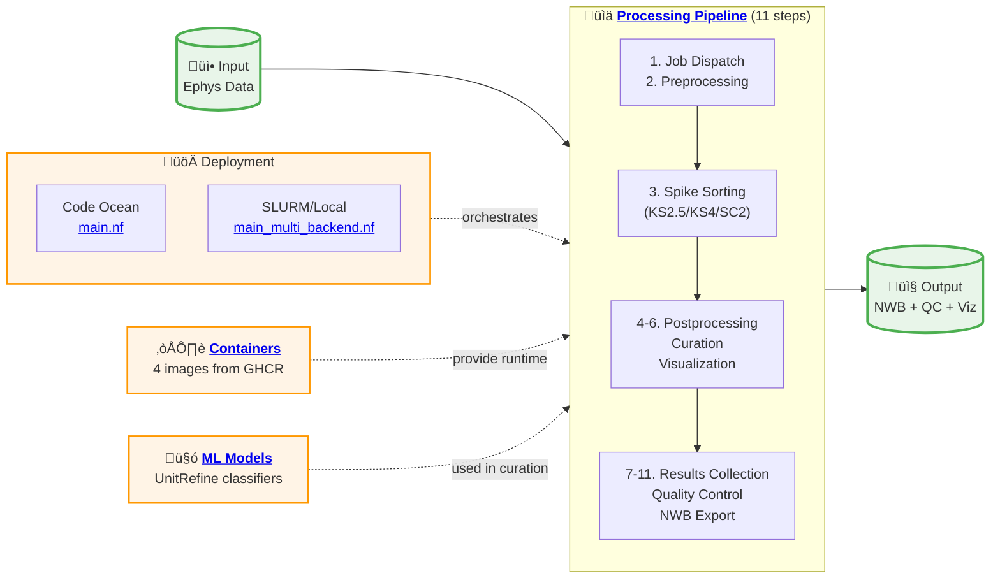

# AIND Ephys Pipeline
## aind-ephys-pipeline

Electrophysiology analysis pipeline with [SpikeInterface](https://github.com/SpikeInterface/spikeinterface).

# Overview

The pipeline is based on [Nextflow](https://www.nextflow.io/) and it includes the following steps:

## Pipeline Architecture

**📖 [View detailed architecture diagram](https://aind-ephys-pipeline.readthedocs.io/en/latest/architecture.html)** with all infrastructure components, step details, and data flow.

**Key Points:**
- **Two Deployment Modes**: Code Ocean ([`main.nf`](pipeline/main.nf)) uses branch-based sorter selection; SLURM/Local ([`main_multi_backend.nf`](pipeline/main_multi_backend.nf)) uses parameter-based selection
- **11 Processing Steps**:
  1. Job dispatch
  2. Preprocessing
  3. Spike sorting (KS2.5/KS4/SC2)
  4-6. Postprocessing → Curation → Visualization
  7-11. Results collection → Quality control → NWB export
- **Infrastructure**: 4 container images from [GHCR](https://github.com/orgs/AllenNeuralDynamics/packages) and [UnitRefine ML models](https://huggingface.co/SpikeInterface) from Hugging Face
- **Parallelization**: Steps run in parallel per probe/shank; version controlled via [`capsule_versions.env`](pipeline/capsule_versions.env)

See the [**detailed architecture documentation**](https://aind-ephys-pipeline.readthedocs.io/en/latest/architecture.html) for complete infrastructure details, data flow, and numbered step-by-step breakdown.

# Documentation

The documentation is available at [ReadTheDocs](https://aind-ephys-pipeline.readthedocs.io/en/latest/).

## Code Ocean Deployment (AIND)

At AIND, the pipeline is deployed on the Code Ocean platform. Since currently Code Ocean does not support conditional processes, pipelines running different sorters and AIND-specific options are implemented in separate branches.

This is a list of the available pipeline branches that are deployed in Code Ocean:

- `main`/`co_kilosort4`: pipeline with Kilosort4 sorter
- `co_kilosort25`: pipeline with Kilosort2.5 sorter
- `co_spykingcircus2`: pipeline with Spyking Circus 2 sorter
- `co_kilosort25_opto`: pipeline with Kilosort2.5 sorter and optogenetics artifact removal
- `co_kilosort4_opto`: pipeline with Kilosort4 sorter and optogenetics artifact removal
- `co_spykingcircus2_opto`: pipeline with Spyking Circus 2 sorter and optogenetics artifact removal